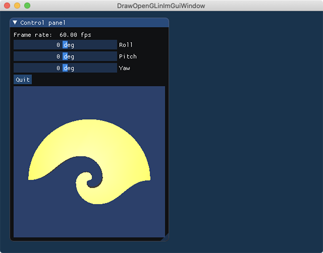

# DrawOpenGLinImGuiWindow

[Dear ImGui](https://github.com/ocornut/imgui) で作成したウィンドウの中に OpenGL で描画するサンプルプログラムです。

## 宿題フレームワーク

私は[授業](http://web.wakayama-u.ac.jp/~tokoi/lecture/gg/)の宿題の雛形を [GLFW](https://www.glfw.org/) ベースで作っているのですが、これは多少なりとも（授業内容とは関係ない）コード量を減らすために、自前のフレームワークを使っていたりします。しかし、このフレームワークには今まで GUI が全くついていませんでした。それで、先日これに Dear ImGui を[組み込めるようにした](https://github.com/tokoik/ggsample01)のですが、

<blockquote class="twitter-tweet"><p lang="ja" dir="ltr">imguiの中のウィンドウでOpenGLの描画をするようなサンプルはまだ存在していなさそうなので、用意していただけるとありがたいです。<br>おそらくリソースを割く価値はあると思います</p>&mdash; 土鍋 (@ssaattwworg) <a href="https://twitter.com/ssaattwworg/status/1211843637534806016?ref_src=twsrc%5Etfw">December 31, 2019</a></blockquote>

ということでしたので、去年の大晦日から随分間が空いてしまいましたけど、ちょっと[サンプルプログラム](https://github.com/tokoik/DrawOpenGLinImGuiWindow)を作ってみました。

## 手順

[Omar](http://www.miracleworld.net/) 氏のアドバイス

<blockquote class="twitter-tweet"><p lang="en" dir="ltr">I think you only need to render to a texture e.g. <a href="https://t.co/hVpNqk9DS7">https://t.co/hVpNqk9DS7</a><br>Once you have your framebuffer in a texture you can call ImGui::Image or ImDrawList::AddImage() functions.</p>&mdash; Omar (@ocornut) <a href="https://twitter.com/ocornut/status/1215995410206089216?ref_src=twsrc%5Etfw">January 11, 2020</a></blockquote>

によれば、`ImGui::Image()` なり `ImDrawList::AddImage()` に OpenGL などのテクスチャを渡せば描いてくれるそうなので、Dear ImGui のサンプル [Image Loading and Displaying Examples](https://github.com/ocornut/imgui/wiki/Image-Loading-and-Displaying-Examples)に従って、フレームバッファオブジェクト (Frame Buffer Object, FBO) を使ってみようと思います。

### FBO を作る

とりあえず FBO のカラーバッファに使う二次元テクスチャを作ります。`fboWidth` と `fboHeight` は、それぞれ FBO の幅と高さです。

```cpp
  // カラーバッファ用のテクスチャを用意する
  GLuint cb;
  glGenTextures(1, &cb);
  glBindTexture(GL_TEXTURE_2D, cb);
  glTexImage2D(GL_TEXTURE_2D, 0, GL_RGBA, fboWidth, fboHeight, 0, GL_RGBA, GL_UNSIGNED_BYTE, 0);
  glTexParameteri(GL_TEXTURE_2D, GL_TEXTURE_WRAP_S, GL_CLAMP_TO_EDGE);
  glTexParameteri(GL_TEXTURE_2D, GL_TEXTURE_WRAP_T, GL_CLAMP_TO_EDGE);
  glTexParameteri(GL_TEXTURE_2D, GL_TEXTURE_MIN_FILTER, GL_LINEAR);
  glTexParameteri(GL_TEXTURE_2D, GL_TEXTURE_MAG_FILTER, GL_LINEAR);
  glBindTexture(GL_TEXTURE_2D, 0);
```

次に、FBO のデプスバッファに使うレンダーバッファを作ります。

```cpp
  // デプスバッファ用のレンダーバッファを用意する
  GLuint rb;
  glGenRenderbuffers(1, &rb);
  glBindRenderbuffer(GL_RENDERBUFFER, rb);
  glRenderbufferStorage(GL_RENDERBUFFER, GL_DEPTH_COMPONENT, fboWidth, fboHeight);
  glBindRenderbuffer(GL_RENDERBUFFER, 0);
```

これらを使って FBO を作ります。

```cpp
  // フレームバッファオブジェクトを作成する
  GLuint fb;
  glGenFramebuffers(1, &fb);
  glBindFramebuffer(GL_FRAMEBUFFER, fb);

  // フレームバッファオブジェクトにカラーバッファとしてテクスチャを結合する
  glFramebufferTexture2D(GL_FRAMEBUFFER, GL_COLOR_ATTACHMENT0, GL_TEXTURE_2D, cb, 0);

  // フレームバッファオブジェクトにデプスバッファとしてレンダーバッファを結合する
  glFramebufferRenderbuffer(GL_FRAMEBUFFER, GL_DEPTH_ATTACHMENT, GL_RENDERBUFFER, rb);

  // フレームバッファオブジェクトの結合を解除する
  glBindFramebuffer(GL_FRAMEBUFFER, 0);
```

### FBO に描画する

あとは描画の前に

```cpp
  glBindFramebuffer(GL_FRAMEBUFFER, fb);
```

を実行すれば、それ以降の描画は画面ではなく FBO に行われるようになります。FBO への描画が終わったら、

```cpp
  glBindFramebuffer(GL_FRAMEBUFFER, 0);
```

を実行しておきます。この直前に `glFlush()` を置いた方がいいかもしれません。

### ImGui のウィンドウに描く

これまでの処理でカラーバッファに使ったテクスチャ `cb` に描画結果が入っていますから、これを `ImGui::Image()` を使って描画します。例えば、こんなインタフェースを作ったとします。

```cpp
    // ImGui のフレームを準備する
    ImGui::NewFrame();

    // ImGui のフレームに一つ目の ImGui のウィンドウを作成する
    ImGui::Begin("Control panel");

    // FPS など表示してみたりする
    ImGui::Text("Frame rate: %6.2f fps", ImGui::GetIO().Framerate);

    // スライダでオイラー角を設定する
    ImGui::SliderAngle("Roll", &roll);
    ImGui::SliderAngle("Pitch", &pitch);
    ImGui::SliderAngle("Yaw", &yaw);

    // Quit ボタンのクリックでループを抜けるようにする
    if (ImGui::Button("Quit")) window.setClose();
```

この後に OpenGL による処理を行います。以下は宿題フレームワークを使ってるので、読み飛ばしてください。ここではモデル変換行列と投影変換行列を求め、モデル変換行列にビュー変換行列を乗じて、光源のデータとともにシェーダに渡しています。

```cpp
    // モデル変換行列にオイラー角を乗じる
    mm = mm.rotateY(yaw).rotateX(pitch).rotateZ(roll);

    // フレームバッファオブジェクトのサイズをもとに投影変換行列を設定する
    const GgMatrix mp(ggPerspective(0.5f, (GLfloat)fboWidth / (GLfloat)fboHeight, 1.0f, 15.0f));

    // シェーダプログラムを指定する
    simple.use(mp, mv * mm, lightBuffer);
```

OpenGL の描画処理（ドローコール）の前に、FBO を指定します。ビューポートは FBO に使ったテクスチャのサイズと一致させます。画面クリアには `glClear()` を使っても構わないのですが、気分的にここでは `glClearColor()` を使いたくなかったので、`glClearBuffer()` で画面 (FBO) を消去します。なお、画面クリアの色のアルファ値を 0 より大きくしないと、背景色が見えません（少し悩みました）。

```cpp
    // フレームバッファオブジェクトを結合する
    glBindFramebuffer(GL_FRAMEBUFFER, fb);

    // ビューポートをフレームバッファオブジェクトのサイズにする
    glViewport(0, 0, fboWidth, fboHeight);

    // カラーバッファを消去する (glClear() でも構わない)
    constexpr GLfloat color[]{ 0.2f, 0.3f, 0.5f, 0.8f }, depth(1.0f);
    glClearBufferfv(GL_COLOR, 0, color);
    glClearBufferfv(GL_DEPTH, 0, &depth);
```

そして、実際に図形を描画します。これは `glDrawElements()` を呼び出しています。

```cpp
    // 図形を描画する
    object.draw();
```

図形の描画が終わったら、フレームバッファを元に戻します。また、ビューポートを親ウィンドウのサイズに戻します。

```cpp
    // フレームバッファオブジェクトの結合を解除する
    glBindFramebuffer(GL_FRAMEBUFFER, 0);

    // ビューポートを復帰する
    window.resetViewport();
```

レンダリング結果のテクスチャが `cb` に入っていますから、これを `ImGui::Image()` で描画します。

```cpp
    // テクスチャを ImGui のウィンドウに描く
    ImGui::Image((void*)(intptr_t)cb, ImVec2(fboWidth, fboHeight));
```

Dear ImGui のフレームへの描画を完了します。

```cpp
    // ImGui のウィンドウの作成を終了する
    ImGui::End();

    // ImGui のフレームに描画する
    ImGui::Render();
```

この処理で次のような表示になります。



### 別のウィンドウに描く

ウィンドウを分けて描くこともできます。最初のユーザインタフェースを描画したところで、一旦、Dear ImGui のウィンドウの作成を終了し、

```cpp
    // ImGui のフレームに一つ目の ImGui のウィンドウを作成する
    ImGui::Begin("Control panel");

    // FPS など表示してみたりする
    ImGui::Text("Frame rate: %6.2f fps", ImGui::GetIO().Framerate);

    // スライダでオイラー角を設定する
    ImGui::SliderAngle("Roll", &roll);
    ImGui::SliderAngle("Pitch", &pitch);
    ImGui::SliderAngle("Yaw", &yaw);

    // Quit ボタンのクリックでループを抜けるようにする
    if (ImGui::Button("Quit")) window.setClose();

    // 【追加】ImGui のウィンドウの作成を終了する
    ImGui::End();
```

`ImGui::Image()` を別のウィンドウで実行するようにして、`cb` のテクスチャを描画します。

```cpp
    // 【追加】ImGui のフレームに二つの ImGui のウィンドウを作成する
    ImGui::Begin("OpenGL");

    // テクスチャを ImGui のウィンドウに描く
    ImGui::Image((void*)(intptr_t)cb, ImVec2(fboWidth, fboHeight));

    // ImGui のウィンドウの作成を終了する
    ImGui::End();
```

この場合は次のような表示になります。


